# Missing | 259 points | OSINT | Easy | 85 solved | 103 attempted

**Resolver:** TheSuspiciousFox

## Description:

Jason todd went missing and all alfred was able to recover from his pc was this file
Help Alfred find Jason

**Author:** Rakhul

**FLAG FORMAT:** dsc{[a-zA-Z0-9_]+}

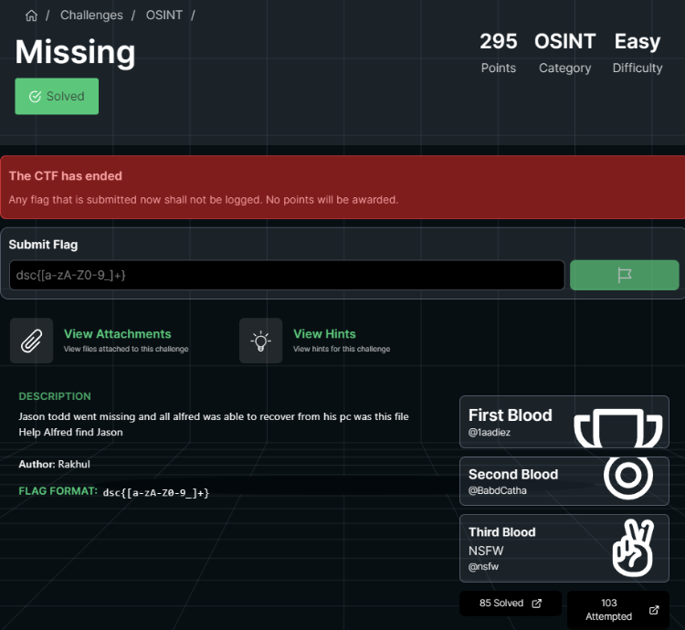

## Used tools:

- John the Ripper
- Git bash
- CyberChief

## Solution:

### Introduction

When I tried to open the archive, I found that it was encrypted:

<!--  -->

    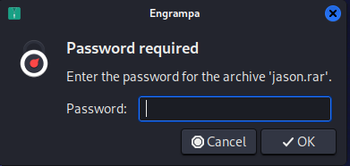

So, I decided to crack the password using the *John the Ripper* tool.

### Step 1: Crack the archive

To extract hash from the archive, I used the *rar2john* tool:

    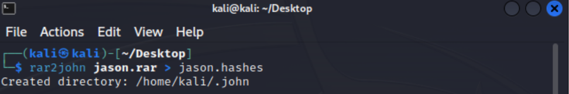

`` rar2john jason.rar > jason.hashes ``

The next step was to prepare *rockyou.txt* wordlist. I'm using a fresh *Kali Linux* virutal machine for all the new ctfs contests, so I had to unpack the wordlist:

    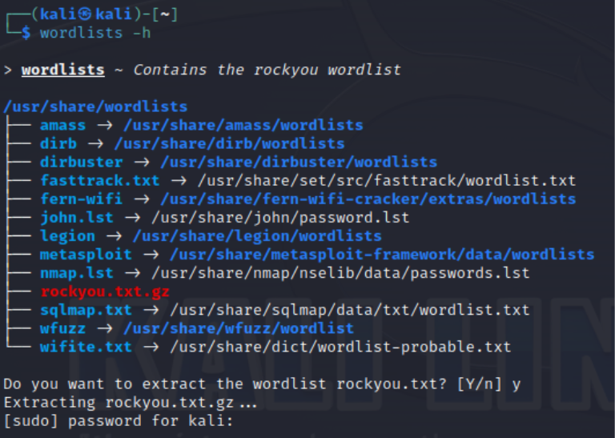

`` wordlists -h `` 

I started cracking using the*rockyou.txt* wordlist. This wordlist is enough for most ctfs challenges:

    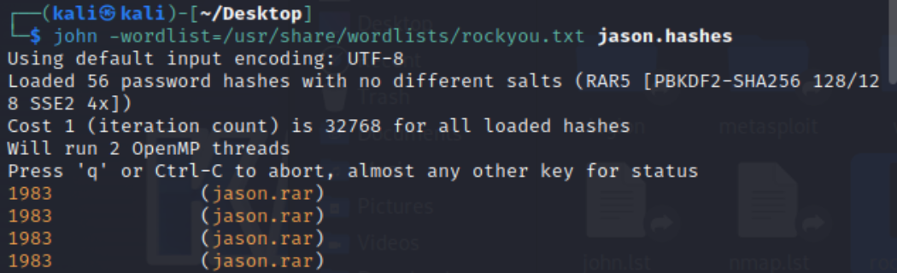
    ...
    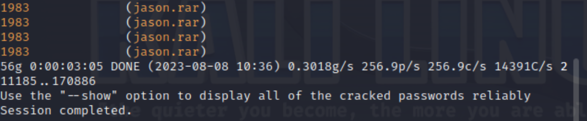

`` john -wordlist=/usr/share/wordlists/rockyou.txt jasnon.hashes `` 

**Note:** If this method failed, I will try to crack the archive with bruteforce method using 5-6 charcters.

To display cracked hashes you can use following command:

    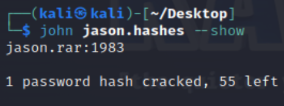

``john jason.hashes --show``

### Step 2: Git repository forencis

After extracting the archive, we have 2 folders with different git repositories:

    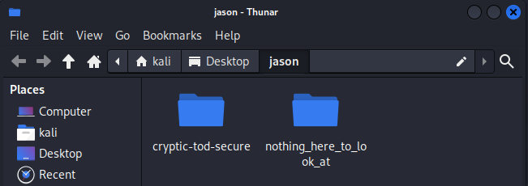

I decided to search the information on this repository using *git*:

    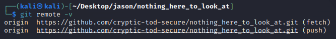

``git remote -v``

In this way I found remote git repository on the github. In the *github* commits I found an interesting commit:

    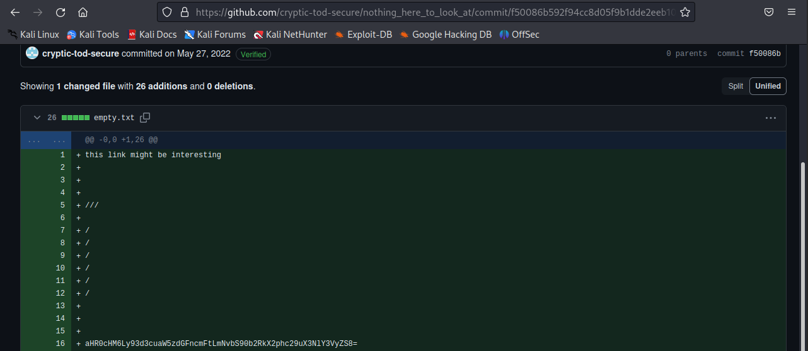

**Note:** Finding the changes may be possible from the local git repository.

The infomration looks like *base64* encoding, so I use the *CyberChief* tool to check it out:

    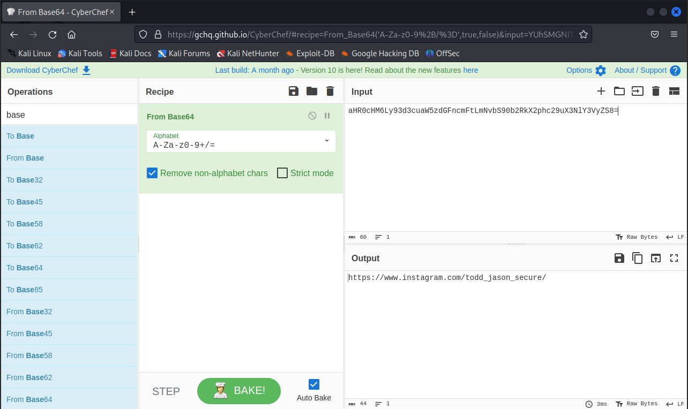

### Step 3: Social media OSINT

Link directs to instagram account with two photos. In the both of them I found interesting information:

    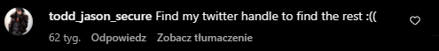
    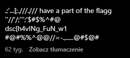

I decided to look for an account name the same as the *instagram* account, but on twitter. I found a tweet with some kind of encoding: 

    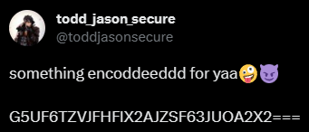

Meanwhile, it wasn't *base64*, but *base32* encoding:

    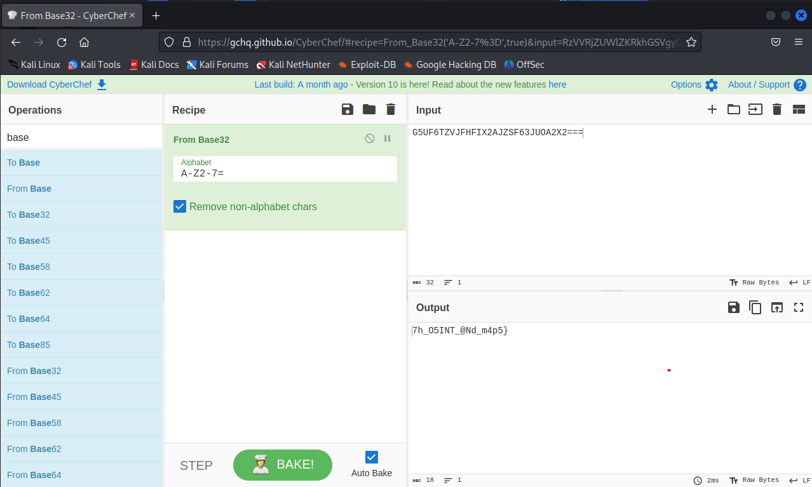

It looks like part of the flag. I merged first piece from the instagram comment with base32 from twetter, and that was a flag :)

**Flag:** dsc{h4vINg_FuN_w17h_O5INT_@Nd_m4p5}

## Summary

This challenge was very funny. OSINT ctfs are not very popular so thats something new for me.